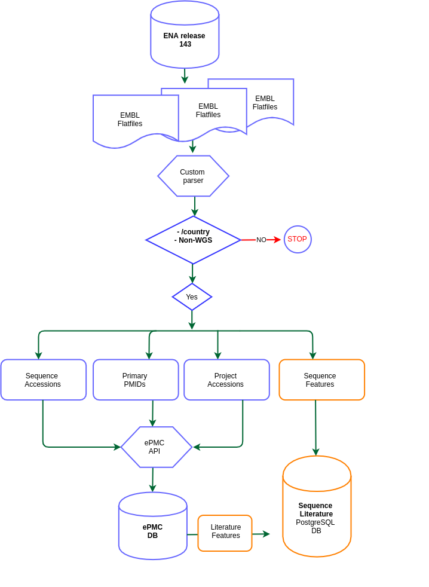

# sequence-literature
This repository will host a set of tidyverse code for Exploratory Analysis and Predictive Modelling of sequences citation in the literature. Sequences originate from the **European Nucleotide Archive** (ENA). The literatures originate from the **EuropePMC** 

#### Data Acquisition Workflow

**1. Code repository:**

[https://github.com/alakob/sequence-literature](https://github.com/alakob/sequence-literature)

1. Code to parse EMBL-flatfiles (embl\_flat\_file\_parser.pl)
2. Code to query ePMC API (query\_epmc.py)

**2. Data source ENA:**

**2.1 ENA release 143 (**03/04/2020**):**

- ftp://[ftp.ebi.ac.uk/pub/databases/ena/sequence/release/std/](http://ftp.ebi.ac.uk/pub/databases/ena/sequence/release/std/)
- files total 208G compressed and 3.5T uncompressed.
- The release contains **263,421,789** sequence entries comprising **408,005,271,872** nucleotides.

**2.2 Breakdown of release by Taxonomy**

| Division | entries |
| --- | --- |
| ENV:Environmental Samples | 16,765,544 |
| FUN:Fungi | 7,511,473 |
| HUM:Human | 27,520,827 |
| INV:Invertebrates | 40,534,979 |
| MAM:Other Mammals | 16,578,137 |
| MUS:Mus musculus | 10,479,013 |
| PHG:Bacteriophage | 17,393 |
| PLN:Plants | 85,618,575 |
| PRO:Prokaryotes | 3,589,696 |
| ROD:Rodents | 3,263,952 |
| SYN:Synthetic | 10,049,087 |
| TGN:Transgenic | 286,472 |
| UNC:Unclassified | 15,943,630 |
| VRL:Viruses | 3,198,057 |
| VRT:Other Vertebrates | 22,064,954 |
| Total | 263,421,789 |

**2.3 Extraction condition:**

Sequence entry must have the **/country** qualifier that represent, the locality of isolation of the sequenced organism indicated in terms of political names for nations, oceans or seas, followed by regions and localities

**2.4 ENA extracted Target**

| Id | Description |
| --- | --- |
| accession | sequence accession |
| primary\_pmid | Primary pubmed id |
| primary\_doi | primary doi , extracted from flat file |
| primary\_pmcid | primary epmc id extracted from flat files |
| origin | Locality of sequence isolation |
| country | Country of sequence isolation |
| submission\_date | Sequence submission date |
| first\_created | Sequence entry first created |
| lat\_lon | geolocation |
| organism | Sequence organism name |
| taxid | Sequence taxonomic id |
| code | sequence taxon |
| project\_acc | Sequence project accession |

**2.5: ENA Extraction statistics.**

| Division | Counts |
| --- | --- |
| INV | 4895011 |
| ENV | 4191787 |
| VRL | 2623044 |
| PLN | 1952666 |
| VRT | 1824633 |
| FUN | 877183 |
| PRO | 868913 |
| MAM | 575165 |
| HUM | 129549 |
| ROD | 79785 |
| PHG | 7958 |
| MUS | 7458 |
| SYN | 737 |
| UNC | 246 |
| TGN | 57 |
| Total | 18034192 |

**3. Data source ePMC**

**3.1 Query terms**

- **Sequence accession** e.g.:AB013190
- **Primary pubmed id** e.g.: 11050544
- **Project accession** e.g.: PRJDB3373

**3.2 ePMC API:**

[https://europepmc.org/RestfulWebService#!/Europe32PMC32Articles32RESTful32API/search](https://europepmc.org/RestfulWebService#!/Europe32PMC32Articles32RESTful32API/search)

**3.3 ePMC extracted Target:**

| Retrieved Field | Description |
| --- | --- |
| accession | Sequenceid| primary accession| project accession |
| idpmc | unique ePMC id |
| source | Literature source eg: MEDLINE |
| pubtype | Publication type |
| issn | ISSN |
| isopenaccess | Is the publication open access |
| secondary\_pmid | pubmed id of the literature hit |
| secondary\_pmcid | pmc id id the literature hit |
| secondary\_doi | DOI of the literature hit |
| author | Author name |
| affiliation | Author affiliation |
| country | Author country |
| first\_pubdate | First publication date |
| first\_epubdate | First electronic publication date |
| orcid | Author ORCID |
| language | Publication language |
| grantid | Grant identifier |
| grant\_agency | Grant Agency |
| grant\_acronym | Grant Acronym |
| receipt\_date | Publication reception date |
| revision\_date | Publication revision date |

**3.4 ePMC extraction statistics:**

| Journal | #accessions | Definition |
| --- | --- | --- |
| MED | 534039 | PubMed/MEDLINE NLM |
| AGR | 4981 | Agricola |
| PMC | 1756 | PubMed Central |
| CBA | 77 | Chinese Biological Abstracts |
| PPR | 70 | Preprints |
| PAT | 24 | Biological Patents |
| CTX | 5 | CiteXplore |
